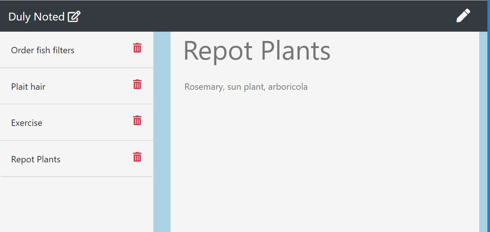

# dulynoted-note-taker-hw11
This is a Git Hub repository for the NU Coding Bootcamp Note Taker with Express Homework for Week 11.




# Setup

Once logged in with [GitHub account](https://github.login/), clone the repo locally using link:

```sh
  git clone https://github.com/gideonrynn/teampacr-profile-generator-hw7.git
```

Also see: [Cloning a repository](https://help.github.com/en/github/creating-cloning-and-archiving-repositories/cloning-a-repository).


# Usage

The Duly Noted application allows a user to create and delete notes, and retrieve previously saved notes at a later date.

Application is initiated in the command line and uses Express.


# Technologies

This project was built using:

  - Node
  - [Express ^4.16.4](https://www.npmjs.com/package/express)


# License

This project uses the MIT License. See the full details here: https://choosealicense.com/licenses/mit/ 